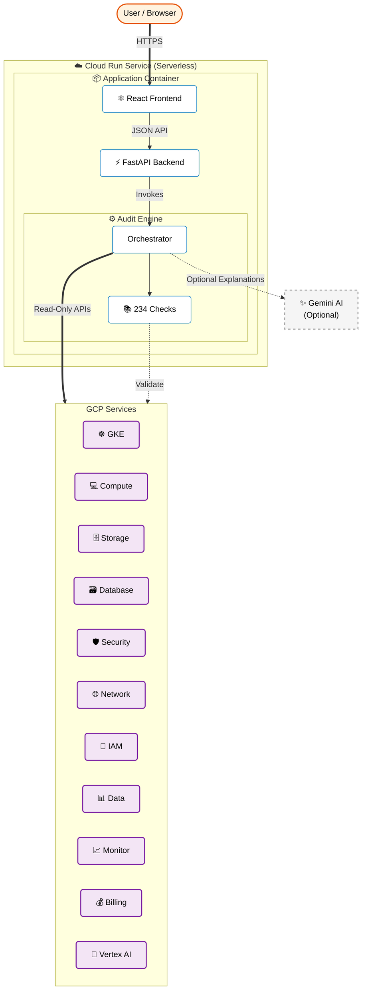

# Democratized Reviewer

> **Audit your Google Cloud environment against 234 best-practice checks across 28 service areas.**
> Viewer-only access. Actionable fix commands. Per-finding AI explanations via Vertex Gemini.

**Democratized Reviewer** is an audit tool designed for cloud practitioners, DevOps and security engineers, SREs, cloud architects, and related roles. It deploys as a serverless container on **Cloud Run**, scanning your organization or project using strictly **read-only** IAM roles.

---

## Features

- **Read-Only Scanning** — Every check is a read-only `gcloud` call; the scanner never mutates the environment it audits. The one exception is report export, which writes to the GCS bucket the deploy script creates for that purpose (`storage.objectAdmin` on that bucket only).
- **Serverless (and hence Fast)** — Runs entirely on Cloud Run. No VMs to manage.
- **Modern Dashboard** — React-based UI with dark mode, severity filtering, and exportable reports.
- **Actionable Fixes** — Every finding includes a precise gcloud command to remediate the issue.
- **AI-Powered Explanations** — Uses Gemini to explain findings and suggest fixes in plain English.
- **234 Checks** — Covers 28 categories: GKE, GCE, GCS, Cloud SQL, AlloyDB, Spanner, Firestore, Memorystore, Security, Networking, IAM, IAP, Data, Monitoring, Billing, Vertex AI, Cloud Run, Cloud Run Jobs, Cloud Functions, App Engine, Composer, Secret Manager, Cloud Build, Artifact Registry, API Security, Patch Management, Compliance & Residency, and org-level Architecture Posture.
- **Compliance Mapping** — Checks are tagged with the controls they are evidence for (CIS GCP Foundation v3.0, ISO/IEC 27001:2022 Annex A, CERT-In Directions 2022, DPDP Act 2023). Reports and the `/scans/{id}/compliance` endpoint regroup findings by control instead of by service.
- **Secure by Design** — Private by default. Access is gated by Cloud Run IAM; open the dashboard via `gcloud run services proxy`.

---

## Quick Start

### 1. Deploy to Cloud Run (Recommended)

Run the setup script from **Google Cloud Shell** or your local terminal (requires `gcloud` authenticated):

```bash
git clone --depth 1 --filter=blob:none --sparse \
  https://github.com/mrghanekar/im-demoreviewer.git im-demoreviewer
cd im-demoreviewer
git sparse-checkout set backend frontend
```
```bash
chmod +x setup.sh
./setup.sh
```

**The setup script automates everything:**
1.  Enables required APIs.
2.  Creates a dedicated read-only Service Account.
3.  **Prompts for Configuration:**
    *   **Org Policy Override:** Asks if you want to allow public access (overriding `allowedPolicyMemberDomains`). Default is **No** — the service stays private and access is gated by Cloud Run IAM.
    *   **Build from source:** Cloud Build runs on every `./setup.sh` and produces an image into your project's Artifact Registry. Takes ~4–5 minutes on a cold build. Guarantees the deployed image always matches the code in your clone.
4.  Deploys to Cloud Run (private by default, single instance).
5.  Grants the deploying user `roles/run.invoker` so you can reach the service immediately.
6.  **Optional public-access prompt:** after the deploy succeeds, asks if you want to grant `allUsers → roles/run.invoker` so anyone with the URL can browse the dashboard. Default is **No** (keep it private; use `gcloud run services proxy`). If you say yes, the script polls `/api/v1/health` with curl until it returns `200` (handles IAM propagation lag, ~10–60s) so you know access is live before the script exits.

### 2. Access the Dashboard

Once deployed, the script prints the **Service URL** and the access method.

**Default (private) deployment:**
```bash
gcloud run services proxy democratized-reviewer --region <region> --project <project>
# then open http://localhost:8080
```
Grant additional users with `gcloud run services add-iam-policy-binding ... --role=roles/run.invoker`.

**Public deployment** (only if you opted into the org-policy override): open the Service URL in your browser.

**Demo / quick browser access** (makes the dashboard public to the internet — don't leave this on for production):
```bash
gcloud run services add-iam-policy-binding democratized-reviewer \
  --member=allUsers --role=roles/run.invoker \
  --region=<region> --project=<project>
# Revoke later with `remove-iam-policy-binding ... --member=allUsers`.
```

### 3. Scan a project OTHER than the deploy project

`setup.sh` only grants the service account viewer roles on the **deploy project**. To scan any other project, the same SA needs viewer access there too. One command per scan target:

```bash
./setup.sh --grant-on PROJECT_ID
```

For org-wide scans (one-shot grant of viewer at the org node, usually requires an Org Admin to run):

```bash
./setup.sh --grant-on-org ORG_ID
```

If you forget this step, the wizard's pre-flight check will catch it before the scan starts and show you the exact gcloud command to fix it.

### 4. Uninstall / Removal

To completely remove the deployment and all associated resources:

```bash
./setup.sh --remove
```

This will remove the Cloud Run service, the Service Account, the Artifact Registry repository, and restore any Organization Policies if they were modified.

#### Demo Cleanup
If you ran the `setup_demo_resources.sh` (or similar) to create vulnerable resources for testing, use the dedicated cleanup script (not in the default sparse-checkout — add `dev` first if you're on a customer install):
```bash
git sparse-checkout add dev    # only needed if dev/ is not yet checked out
./dev/cleanup-demo.sh
```

### setup.sh reference

```
./setup.sh                          Deploy the tool (interactive).
./setup.sh --remove                 Tear down the deploy + SA + bucket + AR.
./setup.sh --grant-on PROJECT_ID    Grant the deploy SA viewer roles on a scan target.
./setup.sh --grant-on-org ORG_ID    Grant the deploy SA viewer roles at the org level.
./setup.sh --help                   Show usage.
```

### Customer hand-off (Google Cloud engineers)

Standard flow when deploying this tool into a customer's environment.

**Required permissions for the person running `./setup.sh`** (on the deploy project):

| Role | Why |
|---|---|
| `roles/resourcemanager.projectIamAdmin` (or `roles/owner`) | To grant the 6 viewer roles to the service account. Without this, Phase 03 fails for most bindings. |
| `roles/iam.serviceAccountAdmin` (or `roles/owner`) | To create the dedicated service account. |
| `roles/run.admin` + `roles/cloudbuild.builds.editor` (or `roles/owner`) | To build the image and deploy it to Cloud Run. |
| `roles/serviceusage.serviceUsageAdmin` (or `roles/owner`) | To enable the ~10 deploy-side APIs. |

In practice the cleanest path is for the customer to grant `roles/owner` on the deploy project (which is typically a fresh "audit-tools" project anyway). If only one role can be added, `roles/resourcemanager.projectIamAdmin` is the bottleneck — Phase 03's bindings fail loudly without it.

| Customer has... | Commands the engineer/customer runs |
|---|---|
| **A single project to audit** | `./setup.sh` in that project — done. |
| **Multiple projects (e.g. 3–50)** | `./setup.sh` in an "audit-tools" project, then for each scan target: `./setup.sh --grant-on TARGET_PROJECT_ID`. |
| **Whole GCP org (50+ projects)** | `./setup.sh` in an audit project, then either the engineer (if they have Org Admin) or the customer's Org Admin runs: `./setup.sh --grant-on-org CUSTOMER_ORG_ID`. With org-level viewer, no per-project grants needed. |

**Pre-flight check**: regardless of which path you took, the scan wizard's pre-flight will validate the SA can actually read the target project BEFORE letting you start a scan. If it can't, you'll get an orange banner with the exact gcloud command to fix it. No more "stuck at Scanning..." surprises.

**Default Cloud Run sizing** (set by `setup.sh`): 2 vCPU, 2Gi memory, 60-minute timeout, `min/max-instances=1`, `DR_MAX_CONCURRENT_CHECKS=5`. These are deliberately conservative — bump them only if scanning very large orgs OOMs the container.

---

## Usage

### Scanning a Project
1.  Select **Project** scope in the wizard.
2.  Enter the **Project ID** you want to audit.
3.  Select which categories (e.g., Security, GKE) to include.
4.  Click **Start Scan**.

### Scanning an Organization
1.  Select **Organization** scope.
2.  Enter your **Organization ID**.
3.  The tool will recursively scan all accessible resources under that organization.

### Remediation
- Review findings in the dashboard.
- Click on any finding to see the **Fix Command**.
- Copy and run the command in your Cloud Shell to resolve the issue.

---

## Security Model

The security model explicitly separates **Deployment** from **Runtime** privileges:

1.  **Deployment (You):**
    -   The user running `./setup.sh` (e.g., you in Cloud Shell) requires **Editor/Owner** permissions on the project to *create* the infrastructure (Cloud Run, Service Account, etc.).
    -   This high-privilege access is used **only** during setup and removal.

2.  **Runtime (The Application):**
    -   The application itself runs as a dedicated Service Account (`democratized-reviewer-sa`).
    -   This account is granted **strictly Read-Only / Viewer** roles (e.g., `roles/viewer`, `roles/iam.securityReviewer`) over the resources it audits.
    -   **It cannot modify the resources it scans.** Every check is a read-only `gcloud` call; even if compromised, the account can only *read* configuration, not change it.
    -   The one write grant is `roles/storage.objectAdmin` scoped to the report-export bucket the setup script creates. Report export writes there; nothing else does. Skip the bucket at setup time if you would rather export only through the browser.

3.  **Organization Policy (Optional Override):**
    -   During setup, you may be prompted to override the `iam.allowedPolicyMemberDomains` constraint.
    -   **Why:** Google Cloud organizations often restrict IAM grants to their own domain. To make the app publicly accessible (e.g., for a demo or external users), this policy must be relaxed on the project.
    -   **Impact:** If overridden, the setup script grants `roles/run.invoker` to `allUsers`.
    -   **Restoration:** The `setup.sh --remove` command will automatically restore this policy to its default state if it was modified.

**Authentication** is handled by Cloud Run IAM. The service is deployed
without `--allow-unauthenticated` (unless you explicitly opt into the public
override during setup). Grant access with:
```bash
gcloud run services add-iam-policy-binding democratized-reviewer \
  --member=user:someone@example.com --role=roles/run.invoker \
  --region <region> --project <project>
```
Revoke with the corresponding `remove-iam-policy-binding`.

**Architecture note:** the app keeps scan results, WebSocket queues, and
rate-limit buckets in memory. Cloud Run is therefore pinned to one instance
(`--min-instances=1 --max-instances=1`); scaling horizontally would require
moving that state to a shared store.

---

## Service Checks Catalog

The tool performs **234** automated checks across your GCP environment
(post-dedup; original v1 catalog was 130).

> **2026-08 audit expansion** added API Security, Artifact Registry, Patch
> Management and Compliance & Residency, and tagged every check with the
> CIS GCP v3.0 / ISO 27001:2022 / CERT-In 2022 / DPDP 2023 controls it is
> evidence for. See [docs/audit-coverage.md](docs/audit-coverage.md) for what
> the tool can and cannot evidence in a formal audit — including the domains
> (MFA/SSO posture, CVE enumeration, DLP content scanning, IR process) that
> need a different instrument.

> **2026-05 catalog expansion** added 9 new service categories
> (Cloud Run, Cloud Functions, Secret Manager, Cloud Build, Memorystore,
> Firestore, Spanner, IAP, Composer) plus org-level architecture posture
> checks, and ~30 new checks inside existing categories. The listing below
> still reflects the original 11 areas; see the in-app checks catalog
> (`/api/v1/setup/checks/catalog`) for the live list.

> **Findings can be suppressed** from the UI (or `POST /api/v1/scans/{id}/findings/{fid}/suppress`)
> to hide accepted-risk noise from the default view and counts.
>
> **Exports**: each scan can be downloaded as JSON, CSV, HTML, or PDF via
> `/api/v1/scans/{id}/export/{format}`, or uploaded to GCS via `POST .../export?bucket=…`.

> **API pre-skip**: each check declares its `required_apis`. The engine fetches
> the project's enabled-API list once per scan and marks dependent checks
> `SKIPPED` (with "service not active in project") instead of letting them 403
> on every gcloud call. `setup.sh` only enables the APIs the **tool itself**
> needs to run (Cloud Run, IAM, Asset Inventory, Service Usage, Org Policy,
> Recommender, Vertex AI) — it never enables scan-target APIs like Spanner /
> Composer / KMS / Memorystore on your behalf. If you don't use a service, its
> checks skip cleanly; enable the API later only when you actually start using
> the service.

### Compute Engine (GCE)
```
GCE/
├── GCE-001                  # Instance has external (public) IP address
├── GCE-002                  # Instance using default Compute Engine service account
├── GCE-003                  # Instance has full API access scope
├── GCE-004                  # Shielded VM features not enabled
├── GCE-005                  # Disk not encrypted with CMEK
├── GCE-006                  # Serial port access enabled
├── GCE-007                  # OS Login not enabled
├── GCE-008                  # No disk snapshots configured
├── GCE-009                  # IP forwarding enabled on instance
├── GCE-010                  # Instance using legacy machine type
├── GCE-011                  # Instance using deprecated OS image
├── GCE-012                  # Deletion protection not enabled
├── GCE-013                  # Spot/preemptible VM in use
└── GCE-015                  # Project-wide SSH keys in metadata
```

### Kubernetes Engine (GKE)
```
GKE/
├── GKE-001                  # Legacy ABAC authorization enabled
├── GKE-002                  # Network policy not enabled on cluster
├── GKE-003                  # Workload Identity not enabled on cluster
├── GKE-004                  # Shielded GKE Nodes not enabled
├── GKE-005                  # Cluster not configured as private
├── GKE-006                  # Node auto-upgrade not enabled
├── GKE-007                  # Node auto-repair not enabled
├── GKE-008                  # Binary Authorization not enabled
├── GKE-009                  # Intranode visibility not enabled
├── GKE-010                  # Cloud Logging not enabled for cluster
├── GKE-011                  # Cloud Monitoring not enabled for cluster
├── GKE-012                  # Node pool autoscaling not enabled
├── GKE-013                  # Node pool not using COS image type
├── GKE-014                  # Master authorized networks not configured
├── GKE-015                  # Pod Security Standards not enforced
├── GKE-016                  # Cluster not using VPC-native mode
├── GKE-017                  # Application-layer secrets encryption not enabled
├── GKE-018                  # Cluster not enrolled in a release channel
├── GKE-019                  # No maintenance window configured
└── GKE-020                  # Vertical Pod Autoscaler not enabled
```

### Cloud Storage (GCS)
```
GCS/
├── GCS-001                  # Bucket is publicly accessible
├── GCS-002                  # Uniform bucket-level access not enabled
├── GCS-003                  # Bucket not encrypted with CMEK
├── GCS-004                  # Object versioning not enabled
├── GCS-005                  # No lifecycle policy configured
├── GCS-006                  # Access logging not enabled on bucket
├── GCS-007                  # No retention policy set on bucket
├── GCS-008                  # Bucket in single region (no geo-redundancy)
├── GCS-009                  # allUsers/allAuthenticatedUsers in bucket IAM policy
└── GCS-010                  # No Object Lock / retention for compliance data
```

### IAM & Identity
```
IAM/
├── IAM-001                  # Primitive role (Owner/Editor) in use
├── IAM-003                  # User-managed service account keys exist (current_state reports key age)
├── IAM-004                  # Over-permissioned service account
├── IAM-005                  # SA impersonation not used (direct keys preferred)
├── IAM-006                  # IAM policy not audited at organization level
├── IAM-007                  # Unused service account (90+ days inactive)
├── IAM-008                  # External members in IAM bindings
├── IAM-009                  # Public access (allUsers/allAuthenticatedUsers) in IAM policy
├── IAM-010                  # No custom IAM roles defined
├── IAM-011                  # Workload Identity Federation not configured
└── IAM-012                  # Domain-restricted sharing not enforced
```

### Networking
```
Networking/
├── NET-001                  # Firewall rule allows SSH (22) from 0.0.0.0/0
├── NET-002                  # Firewall rule allows RDP (3389) from 0.0.0.0/0
├── NET-003                  # Firewall rule allows all ports from 0.0.0.0/0
├── NET-004                  # Default VPC network exists
├── NET-005                  # VPC Flow Logs not enabled on subnet
├── NET-006                  # Private Google Access not enabled on subnet
├── NET-007                  # Cloud NAT not configured for VPC
├── NET-008                  # DNSSEC not enabled on managed DNS zone
├── NET-009                  # SSL policy using weak TLS version
├── NET-010                  # No Cloud Armor security policies defined
├── NET-011                  # Classic VPN gateway in use
├── NET-012                  # HTTPS redirect not configured on HTTP load balancer
└── NET-014                  # Load Balancer backend service has no backends
```

### Databases (Cloud SQL)
```
Databases/
├── DB-001                   # Cloud SQL instance has public IP
├── DB-002                   # Cloud SQL SSL/TLS not enforced
├── DB-003                   # Automated backups not enabled
├── DB-004                   # Cloud SQL high availability not configured
├── DB-005                   # Authorized networks include 0.0.0.0/0
├── DB-006                   # Point-in-time recovery not enabled
├── DB-007                   # No maintenance window configured for Cloud SQL
├── DB-008                   # Cloud SQL running outdated database version
├── DB-009                   # Cloud SQL not encrypted with CMEK
├── DB-010                   # Query Insights not enabled
├── DB-011                   # No read replicas configured
├── DB-012                   # Storage auto-resize not enabled
├── DB-013                   # No password policy configured
├── DB-014                   # Database audit logging not enabled
└── DB-015                   # Cloud SQL deletion protection not enabled
```

### Security & Org Policies
```
Security/
├── SEC-002                  # VPC Service Controls not configured
├── SEC-003                  # Security Command Center not enabled
├── SEC-007                  # Web Security Scanner not configured
├── SEC-008                  # Cloud DLP not configured for sensitive data
├── SEC-009                  # Certificate Authority Service not in use
└── SEC-010                  # Access Transparency not enabled
```

### Data Services
```
Data/
├── DATA-001                 # BigQuery dataset not encrypted with CMEK
├── DATA-002                 # BigQuery dataset has public access
├── DATA-003                 # BigQuery dataset has no default table expiration
├── DATA-004                 # Pub/Sub subscription has no dead-letter topic
├── DATA-005                 # Pub/Sub subscription has no expiration
├── DATA-006                 # Pub/Sub topic not encrypted with CMEK
├── DATA-007                 # Dataflow jobs running in default region
├── DATA-008                 # Dataproc cluster without autoscaling
├── DATA-009                 # BigQuery audit logging not fully enabled
└── DATA-010                 # Data Catalog not enabled for data governance
```

### Monitoring & Observability
```
Monitoring/
├── MON-002                 # No alerting policies configured
├── MON-003                 # No notification channels configured
├── MON-004                 # No log sinks configured
├── MON-005                 # No uptime checks configured
├── MON-006                 # Log bucket retention below recommended threshold (default 90 days)
├── MON-008                 # No custom monitoring dashboards
├── MON-009                 # Error Reporting not enabled
└── MON-010                 # Cloud Trace not enabled
```

### Billing & Cost
```
Billing/
├── BIL-001                  # No billing budget alerts configured
├── BIL-002                  # Unused persistent disks (not attached)
├── BIL-003                  # Unused static external IP addresses
├── BIL-004                  # Old disk snapshots (>90 days)
├── BIL-005                  # No committed use discounts (CUDs) configured
├── BIL-006                  # Potentially idle VM instances
├── BIL-007                  # Oversized VM instances (right-sizing opportunity)
├── BIL-008                  # Resources without cost-allocation labels
├── BIL-009                  # Standard storage class used for infrequently-accessed data
└── BIL-010                  # Billing export to BigQuery not configured
```

### Vertex AI
```
Vertex AI/
├── VTX-001                  # Vertex AI Workbench notebook has public IP
├── VTX-002                  # Notebook using default Compute Engine service account
├── VTX-003                  # Vertex AI Model Endpoint is publicly accessible
├── VTX-004                  # Vector Search Index Endpoint is public
├── VTX-005                  # Workbench instance has no idle shutdown
├── VTX-006                  # Model endpoint not encrypted with CMEK
└── VTX-007                  # Custom training job has public IP (no VPC peering)
```

### New service categories (2026-05 expansion)

```
Cloud Run/                   # 8 checks (CR-001..CR-008)
  Public access, plaintext secrets, no VPC connector, unbounded scale,
  cold-start risk, default SA, CMEK, ingress 'all'.

Cloud Functions/             # 6 checks (FN-001..FN-006)
  Public invokable, plaintext secrets, deprecated runtime, default SA,
  no VPC connector, unbounded scale.

Secret Manager/              # 7 checks (SM-001..SM-007)
  No rotation, public IAM, no CMEK, global replication, version sprawl,
  stale (>1 year), no ownership labels.

Cloud Build/                 # 5 checks (CB-001..CB-005)
  Untrusted-fork triggers, default SA, no approval gate on prod,
  permissive substitutions, no private worker pool.

Memorystore/                 # 5 checks (MS-001..MS-005)
  AUTH disabled, no TLS, BASIC tier (no HA), no CMEK, no maintenance policy.

Firestore/                   # 4 checks (FS-001..FS-004)
  No PITR, no backup schedule, no delete protection, no CMEK.

Spanner/                     # 4 checks (SP-001..SP-004)
  Single-region, no backup schedule, no CMEK, low processing units.

IAP/                         # 3 checks (IAP-001..IAP-003)
  No OAuth brand, backend services without IAP, App Engine not IAP-gated.

Composer/                    # 4 checks (CMP-001..CMP-004)
  Public endpoint, no CMEK, deprecated Composer 1.x image, default VPC.

Architecture Posture/        # 5 checks (POST-001..POST-004, POST-006)
  Missing recommended org policies, project not in folder,
  no Asset Inventory feed, unactioned Recommender insights,
  enabled APIs with no resources (cost + attack-surface waste).
```

### G6 additions (post-audit catalog gaps)

```
AlloyDB/                     # 5 checks (ADB-001..ADB-005)
  No automated backups, no deletion protection, no CMEK,
  public IP / no PSC enforcement, no continuous backup (PITR).

App Engine/                  # 5 checks (AE-001..AE-005)
  Deprecated runtime, default SA, plaintext secrets,
  no IAP, traffic split routing to deprecated-runtime version.

Cloud Run Jobs/              # 3 checks (CRJ-001..CRJ-003)
  Default Compute SA, max-retries=0, plaintext secrets in env.
```

### Additions to existing categories

```
IAM:        IAM-013 data-access audit logs disabled  |  IAM-014 no IAM conditions
            IAM-015 SA-impersonation chains (priv-esc)  |  IAM-016 shadow admin via key-admin

Security:   SEC-011 KMS short destruction-delay      |  SEC-012 KMS rotation > 1 year
            SEC-013 BinAuthz dryrun                  |  SEC-014 Cloud Armor no managed rules
            SEC-015 No Confidential VMs in project

Networking: NET-015 LB without Cloud Armor           |  NET-017 cert expiring < 30 days

GKE:        GKE-021 deprecated K8s version           |  GKE-022 Backup for GKE off
            GKE-023 consider Autopilot

GCS:        GCS-011 CMEK key in same project         |  GCS-012 no Pub/Sub notifications

Cloud SQL:  DB-016 IAM DB auth disabled              |  DB-013 no password policy

Monitoring: MON-011 no SLOs                          |  MON-012 sink to external GCS

Data:       DATA-011 BigQuery unpartitioned large    |  DATA-012 Dataproc public IPs
            DATA-013 Pub/Sub no schema

Billing:    BIL-011 BigQuery LOGICAL billing         |  BIL-012 idle GKE node pool
```

## Troubleshooting

| Symptom | Likely cause | Fix |
|---|---|---|
| `setup.sh` fails at "Validating governance policies" | `orgpolicy.googleapis.com` or `cloudresourcemanager.googleapis.com` not enabled on the deploy project | Run `gcloud services enable orgpolicy.googleapis.com cloudresourcemanager.googleapis.com --project=PROJECT` and re-run setup |
| Cloud Run deploy shows "PERMISSION_DENIED on iam.allowedPolicyMemberDomains" | Org policy forbids `allUsers`; the setup script offered to override it but you declined | Either re-run setup and accept the override, or grant per-user invoker access: `gcloud run services add-iam-policy-binding democratized-reviewer --member=user:YOU --role=roles/run.invoker --region=REGION --project=PROJECT` |
| Org-scope scan returns 0 or 1 project | Service account lacks `roles/cloudasset.viewer` or `roles/browser` at the **organization** level (setup.sh only grants at project level) | Manually grant in Console: IAM & Admin → "View by principal" → service account → Add role at org node |
| Many checks show "Skipped: service not active in project" | Target APIs aren't enabled on the scanned project — by design, not a bug. `setup.sh` deliberately does NOT enable scan-target APIs on your behalf, so unused services don't get flipped on for the sake of a posture check | If you actually use the service and want findings, run `gcloud services enable <api> --project=SCAN_TARGET`. The relevant API for each missing check is in the SKIPPED message |
| Scan stuck in PENDING after Cloud Run instance restart | Pre-restart scans were marked FAILED on the next instance start (see C3 orphan handling); a stuck PENDING means the scan started AFTER restart and is genuinely running | Wait, or `DELETE /api/v1/scans/{id}` to cancel |
| Suppressing a finding shows no immediate feedback | The HTTP request returns immediately while the GCS save happens in the background. The in-memory state is already updated | Reload the page — the suppression persists |
| Billing checks (BIL-001/005) always show "Could not verify" | Service account has `roles/billing.viewer` at the project level only; billing-account lookups need it on the billing account itself | Grant `roles/billing.viewer` on the billing account: `gcloud billing accounts add-iam-policy-binding BILLING_ACCOUNT_ID --member=serviceAccount:SA_EMAIL --role=roles/billing.viewer` |
| Spanner / AlloyDB API enablement fails | Both require billing on the project before they can be enabled | Link a billing account first: `gcloud billing projects link PROJECT --billing-account=BILLING_ACCOUNT_ID` |
| `gcloud auth` expired mid-scan | Service-account credentials don't expire; if this happens you're running locally with user creds | `gcloud auth login` (locally) or rely on Cloud Run's attached SA (deployed) |
| Vertex AI "Explain" button returns 500 | `aiplatform.googleapis.com` not enabled or the SA lacks `roles/aiplatform.user` | Enable the API and grant the role; explanation cache means the next retry hits Gemini |
| Wizard says "Pre-flight check failed: SA can't read &lt;project&gt;" | The deploy SA doesn't have viewer roles on the scan target. The wizard caught this BEFORE wasting a scan | Run the command shown in the banner, or `./setup.sh --grant-on PROJECT_ID`. Wait ~30s for IAM propagation, click Launch again |
| Scan completes in &lt;30s with hundreds of SKIPPED "Aborted: ... permission" messages | The engine's 403-storm guard fired: SA hit 5+ PERMISSION_DENIED in 30s, short-circuited the remaining 200 checks | Same fix as above — grant the SA viewer on the scan target via `./setup.sh --grant-on PROJECT_ID` |
| Results page shows yellow "No progress in the last 60 seconds" banner | Live scan-event stream is silent. Either the BackgroundTask died on a Cloud Run instance restart, or the scan is stuck on a slow / hung gcloud call | Check Cloud Run logs (`gcloud run services logs read democratized-reviewer --region=REGION --limit=50`). If logs show errors, fix them; if logs show nothing, the task died — cancel via `← New Scan` and re-launch |
| Cloud Run OOMs during scan (`Memory limit exceeded`) | The default deploy uses 2Gi which is enough for typical scans. Very large orgs (1000+ projects) can still exhaust it | Bump memory: `gcloud run services update democratized-reviewer --memory=4Gi --region=REGION`. Or lower `DR_MAX_CONCURRENT_CHECKS` from 5 to 3 |
| Phase 03 shows "N of 6 role bindings failed" | The account running `setup.sh` lacks `roles/resourcemanager.projectIamAdmin` (or `roles/owner`) on the deploy project, so it can't grant viewer roles to the SA | Ask a Project Owner to grant you `roles/resourcemanager.projectIamAdmin` on the deploy project and re-run `./setup.sh`. The script's failure message prints the exact `gcloud projects add-iam-policy-binding` commands to hand them if they prefer to grant directly. |
| Cloud Build fails with `error TS2304: Cannot find name 'useState'` (or similar TS error) | Frontend type error in the source. If you didn't edit anything, your clone may be behind a known-good commit | `cd ~/im-demoreviewer && git pull origin main && git log -1 --oneline` — re-run `./setup.sh`. If the error persists after pulling, file an issue. |

## Project Structure

```
im-demoreviewer/
├── backend/                 # FastAPI application
│   ├── api/                 # API routes and middleware
│   ├── checks/              # Logic for 234 GCP checks
│   ├── core/                # Core engine, scanning logic
│   └── utils/               # Helpers (formatting, GCP)
├── frontend/                # React application
│   ├── src/                 # Frontend source code
│   └── public/              # Static assets
├── Dockerfile               # Multi-stage build definition
├── README.md                # This file
├── setup.sh                 # Deployment automation script
└── dev/                     # Internal: NOT cloned by the customer sparse-checkout
    ├── AGENTS.md            #   Claude Code instructions
    ├── PLAN.md, PRD.md      #   Product / design docs
    ├── tests/               #   Pytest suite
    ├── cloudbuild.yaml      #   Cloud Build pipeline (manual trigger)
    ├── docker-compose.yml   #   Local development setup
    ├── Dockerfile.dev       #   Local dev image
    └── cleanup-demo.sh      #   Demo teardown
```

## Architecture

The application is designed as a **serverless monolith** to minimize complexity.


- **Frontend:** React SPA built with Vite, served statically by FastAPI in production.
- **Backend:** FastAPI service handling API requests and running audit logic.
- **Engine:** Python-based scanner that executes checks against GCP APIs (Asset Inventory, Compute, etc.).
- **Security:** In-memory state only. No database required. Credentials via environment variables or Metadata Server.





---

*Built with ❤️ for the best ops teams of the best cloud.*